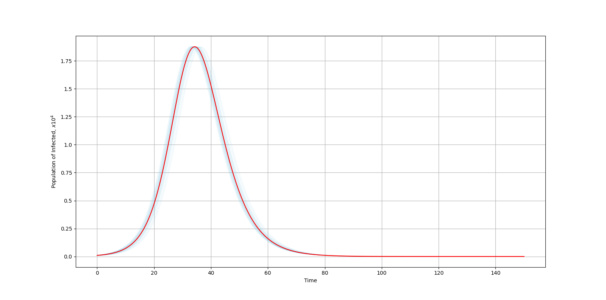
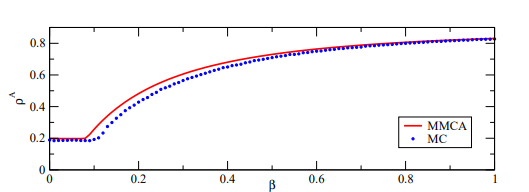
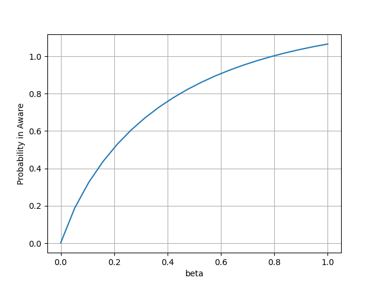

# Mathematical epidemiology: Study notes

Couple of scientific notes were studied and here's presented some discussion.
The first one tells us about SIR system of ODE's solutions which represents the spreading of pandemic in time.
Using the SciPy and Runge-Kutta method we received the Infected Group population function of the time by solving Cauchy problem for normal distribution
of initial conditions. As a result: red line is probably expected & blue variants are stochastic.

The second one reveals the Markov Chains Approach in Interaction of Networks:
Acturally, Pandemic and Aware, Fair of Pandemic respectively. Unfortunately, authors haven't shown the scrips of simulation and just tried to build up the plots by solving the problem I had established by myself. Here you may see both results

For, sure probability can't be greater than 1, but if we get some assumption, we may realize the similar trends of plotted lines.

